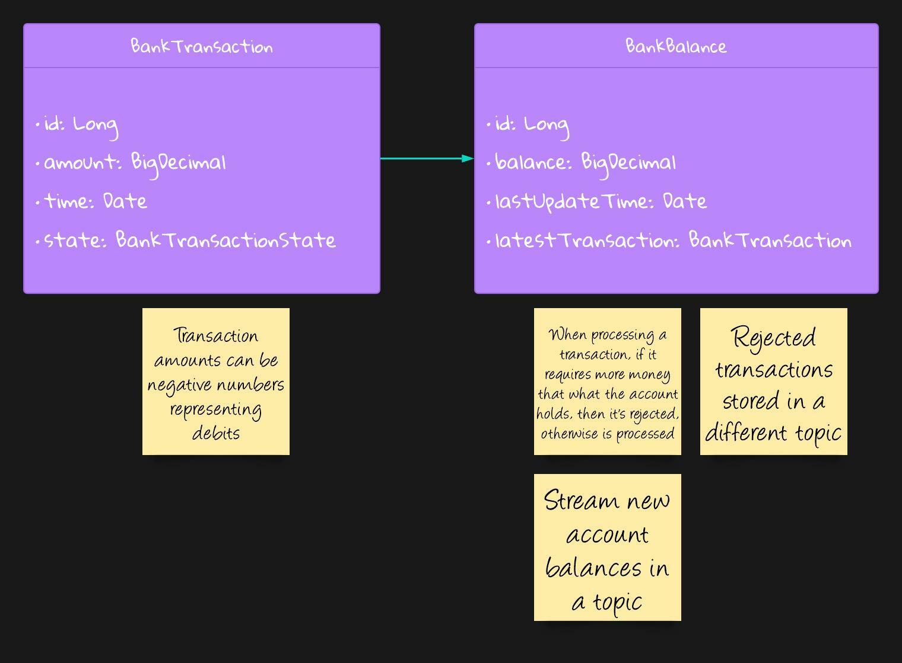
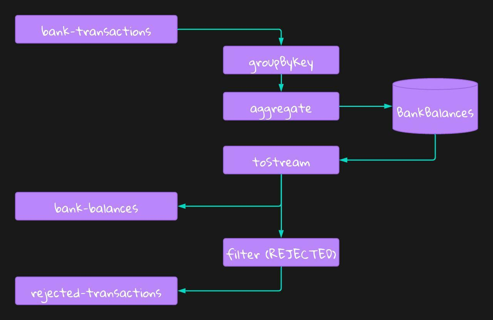

#Bank Transactions: Stateful Processing in Kafka Streams

## Our Application
It is a bank that holds its customer's bank balances in a Kafka Streams application. We are going to develop a topology that will process bank transactions and will stream updates of every new balance for a given user. The application will also stream all the rejected transactions into a different topic for error handling purposes.

## The Data Model


### Bank Transaction
The [`BankTransaction`](src/main/java/com/example/model/BankTransaction.java) will hold the data regarding the transactions that will be processed. It will hold an amount that can be either positive or negative, representing credits or debits, respectively.
### Bank Balance
The [`BankBalance`](src/main/java/com/example/model/BankBalance.java) class will store the account balance for the user, and it will also hold information about the latest transaction.

## The Topology

In the topology, we are going to:
1. Stream the topic `bank-transactions` where the key is the `balanceId`
2. `groupByKey the stream
3. Use the `aggregate` operation to aggregate the all the transactions that have the same key into a single account balance. The balances will be stored in a State Store. This operation will return a `KTable`
4. Transform the `KTable` into a `KStream`. This means that any change occurring in the table will be streamed as an event
5. Stream the events into the `bank-balances` topic
6. `map` the `BankBalance` into `BankTransaction` by keeping the last transaction
7. `filter` the transactions to keep only the `REJECTED` transactions
8. `stream` the rejected transactions into the `rejected-transactions` topic

## Running the project

### Starting Kafka
First, we need to start Kafka. For that we have a [docker-compose.yml file](docker-compose.yml) that will create the necessary resources for us. It will start a Zookeeper instance and a Kafka broker. It will also create the necessary topics using the script found in the [create-topics.sh](./scripts/create-topics.sh) file.
```shell
docker compose -f ./docker-compose.yml up
```